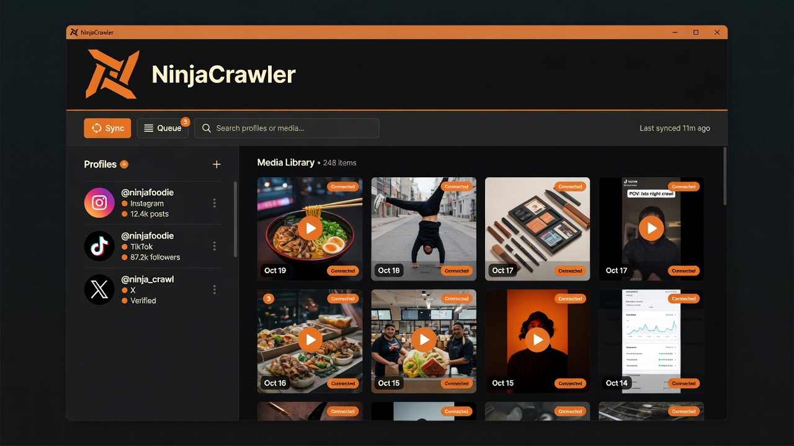

<div align="center">

<picture>
  <source media="(prefers-color-scheme: dark)" srcset="assets/brand/ninjacrawler-lockup-horizontal-dark.svg">
  
</picture>

<br>

**Organize social profiles, download media, and run recurring syncs — on your Windows machine.**

Supports **Instagram** · **TikTok** · **X / Twitter** · optional **Chrome Companion**

[](https://github.com/JustShinobi/NinjaCrawler/releases)
[](https://github.com/JustShinobi/NinjaCrawler/actions/workflows/ci.yml)
[](https://github.com/JustShinobi/NinjaCrawler/releases)

<p>
<!-- ninjacrawler-release-start -->
<a href="https://github.com/JustShinobi/NinjaCrawler/releases/download/v0.21.0/NinjaCrawler-0.21.0-windows-x64-setup.exe">
  
</a>
<!-- ninjacrawler-release-end -->
&nbsp;
<!-- ninjacrawler-companion-release-start -->
<a href="https://github.com/JustShinobi/NinjaCrawler/releases/download/companion-v0.17.0/NinjaCrawler-Companion-0.17.0.zip">
  
</a>
<!-- ninjacrawler-companion-release-end -->
</p>

<!-- ninjacrawler-release-start -->
<p>
<sub>
App v0.21.0 ·
<a href="https://github.com/JustShinobi/NinjaCrawler/releases/download/v0.21.0/NinjaCrawler-0.21.0-windows-x64-portable.exe">portable</a> ·
<a href="https://github.com/JustShinobi/NinjaCrawler/releases/download/v0.21.0/SHA256SUMS.txt">checksums</a> ·
<a href="https://github.com/JustShinobi/NinjaCrawler/releases">all releases</a> ·
<a href="CHANGELOG.md">changelog</a>
</sub>
</p>
<!-- ninjacrawler-release-end -->

<!-- ninjacrawler-companion-release-start -->
<p>
<sub>
Companion 0.17.0 ·
<a href="https://github.com/JustShinobi/NinjaCrawler/releases/download/companion-v0.17.0/NinjaCrawler-Companion-0.17.0.zip">extension ZIP</a> ·
<a href="https://github.com/JustShinobi/NinjaCrawler/releases?q=companion-v&amp;expanded=true">companion releases</a>
</sub>
</p>
<!-- ninjacrawler-companion-release-end -->

<br>



<sub>Product preview of the desktop workspace (illustrative).</sub>

</div>

---

NinjaCrawler is a **local-first** Windows app for operators who manage many social profiles: sync media to disk, queue downloads per provider, schedule work, and import browser sessions without sending secrets to third-party servers.

> [!NOTE]
> Pre-1.0 software. Configuration formats, provider behavior, and migrations may change before a stable release.

## Highlights

### Profiles & media

- Manage provider accounts and tracked profiles in a native Windows workspace
- Download and catalog media from Instagram, TikTok, and X/Twitter
- Browse by profile and date, open the original post, or reveal the file on disk

### Queues & scheduler

- Persistent download queues per provider — pause, resume, cancel, retry, reorder
- Scheduler sets, plans, groups, filters, and date constraints
- Sync options configurable per account and per profile

### Companion & accounts

- **NinjaCrawler Companion** (Chrome): add profiles, queue syncs, import the signed-in browser account, capture stories
- Session cookies stay on the machine and travel only over loopback to the desktop app

### Import & connectors

- Import existing SCrawler media without duplicating files
- Managed connector runtimes (`gallery-dl`, `yt-dlp`, Instaloader) downloaded and verified by the app

## Getting started

### Desktop app

<!-- ninjacrawler-release-start -->
1. **[Download NinjaCrawler for Windows](https://github.com/JustShinobi/NinjaCrawler/releases/download/v0.21.0/NinjaCrawler-0.21.0-windows-x64-setup.exe)** (setup installer).
2. Prefer no install? Use the standalone [portable executable](https://github.com/JustShinobi/NinjaCrawler/releases/download/v0.21.0/NinjaCrawler-0.21.0-windows-x64-portable.exe).
3. Optional: verify the file against [SHA256SUMS.txt](https://github.com/JustShinobi/NinjaCrawler/releases/download/v0.21.0/SHA256SUMS.txt).
<!-- ninjacrawler-release-end -->

> [!WARNING]
> Builds are currently **unsigned**. Windows SmartScreen may show an unknown-publisher warning — choose **More info** → **Run anyway** only if you trust this repository.

On first launch the app downloads and verifies connector runtimes (internet required once). Application data lives under `%LOCALAPPDATA%\NinjaCrawler`. Portable mode only skips installing the app binary; data paths stay the same.

### Chrome Companion (optional)

<!-- ninjacrawler-companion-release-start -->
1. **[Download the Companion ZIP](https://github.com/JustShinobi/NinjaCrawler/releases/download/companion-v0.17.0/NinjaCrawler-Companion-0.17.0.zip)** (also attached to desktop app releases).
2. Extract it. The archive always contains a stable `NinjaCrawler-Companion` folder.
3. Start NinjaCrawler, open `chrome://extensions`, enable **Developer mode**, then **Load unpacked** and select that folder.
<!-- ninjacrawler-companion-release-end -->

**Recommended install path for updates:** load unpacked from  
`%LOCALAPPDATA%\NinjaCrawler\Companion` after NinjaCrawler stages a release there, then use **Reload extension** in the Companion popup (or Chrome’s Reload).

**Manual updates:** extract a new ZIP over the loaded folder and click **Reload** on `chrome://extensions`.

See [Chrome Companion](#chrome-companion) for behavior details.

## Supported providers

| Provider | Current scope |
| --- | --- |
| **Instagram** | Multiple accounts, posts, reels, stories, highlights, tagged media, saved posts, profile metadata, targeted story downloads |
| **TikTok** | Multiple accounts, videos, photo posts, stories, reposts, avatars, date ranges, configurable naming |
| **X / Twitter** | Profile media timeline, avatars, duplicate prevention, handle recovery via stable user IDs |

Behavior depends on the platform, authentication, rate limits, and managed connector capabilities.

## How it works

Stack: **Rust** · **Tauri 2** · **React** · **TypeScript**. Metadata lives in local **SQLite**; media files stay on disk where you can open them directly.

```text
Chrome Companion (optional)
      │  loopback API  (127.0.0.1)
      ▼
React workspace
      │
      ▼
Tauri command bridge
      │
      ▼
Rust application runtime ─── SQLite workspace
      │
      ├── provider queues and scheduler
      ├── internal provider connectors
      └── managed external tools
              │
              ▼
        Media folders on disk
```

Providers are compiled into the app (not a drop-in plugin ABI). External tools provide extraction; queueing, rules, persistence, and UI stay in NinjaCrawler.

## Chrome Companion

The extension in [`NinjaCrawler.Companion`](NinjaCrawler.Companion) bridges Chrome and the desktop app:

- Detect supported profile tabs and add a selected batch
- Queue sync for the active profile
- Import the signed-in browser account (cookies stay local)
- Download the selected Instagram or TikTok story when the URL/media id is known
- Themes, keyboard shortcuts, and update guidance when a newer Companion is available
- With NinjaCrawler running: **Download to AppData** stages the ZIP under `%LOCALAPPDATA%\NinjaCrawler\Companion`, then **Reload extension** applies it when that folder is the loaded path

The extension talks only to `http://127.0.0.1:47219`. Session material is stored in NinjaCrawler’s protected session store.

Desktop app releases (`vX.Y.Z`) co-ship the Companion ZIP from that commit. Companion-only releases (`companion-vX.Y.Z`) ship extension updates independently; in-app update links use the Companion track.

More detail: [Companion README](NinjaCrawler.Companion/README.md) · [account import](docs/companion-account-import.md) · [release packaging](docs/companion-release-packaging.md).

## Requirements

Runtime (end users):

- Windows 10 or Windows 11 (x64)
- Microsoft Edge WebView2 Runtime
- Internet access on first launch (connector download)

Development builds also need:

- Node.js LTS and npm
- Rust stable with the MSVC target
- Visual Studio 2022 Build Tools — Desktop development with C++
- PowerShell 5.1 or newer

## Development

```powershell
git clone https://github.com/JustShinobi/NinjaCrawler.git
cd NinjaCrawler
npm ci
Tools\Dev-Desktop.cmd
```

Frontend only (native Tauri commands unavailable):

```powershell
npm run dev
```

## Validation

```powershell
npm run lint
npm test
npm run build
```

Full desktop build:

```powershell
powershell -ExecutionPolicy Bypass -File Tools\Build-NinjaCrawler.ps1 -Configuration Debug
```

Release build + smoke test before publishing:

```powershell
powershell -ExecutionPolicy Bypass -File Tools\Build-NinjaCrawler.ps1 -Configuration Release
powershell -ExecutionPolicy Bypass -File Tools\SmokeTest-NinjaCrawler.ps1 -Configuration Release
```

Artifacts:

```text
src-tauri\target\release\                 # portable exe
src-tauri\target\release\bundle\          # installers
```

Use `-PortableOnly` when installers are not required.

## Continuous integration and releases

GitHub Actions runs frontend quality on hosted `ubuntu-latest` and a Windows x64 cross-build for trusted PRs on self-hosted runners.

Pull requests get a merge-method label (`merge:squash` vs `merge:merge-commit`). Feature work into `develop` is squash; promote/release paths use **merge commits**. See [merge policy](docs/merge-policy.md).

The desktop app and Chrome Companion use **independent** Release Please tracks:

| Track | Version files | Tag |
| --- | --- | --- |
| App | `package.json`, `tauri.conf.json`, `Cargo.toml` | `vX.Y.Z` |
| Companion | `NinjaCrawler.Companion/manifest.json` (only Companion paths) | `companion-vX.Y.Z` |

1. Merge Conventional Commits from `develop` → `main`.
2. Release Please opens release PR(s) for the track(s) that changed.
3. Merging a release PR creates a draft GitHub Release and dispatches the matching publish workflow.

**App release assets:** changelog, portable exe, NSIS setup, Companion ZIP from the release tree, SHA-256 sums.

**Companion release assets:** extension ZIP + checksums (canonical for in-app update links).

Versions below `1.0.0` publish as GitHub prereleases. An existing tag can be republished from the **Release** workflow.

## Local data

| What | Default path |
| --- | --- |
| App data | `%LOCALAPPDATA%\NinjaCrawler\` |
| SQLite DB | `%LOCALAPPDATA%\NinjaCrawler\data\ninjacrawler.db` |
| Staged Companion | `%LOCALAPPDATA%\NinjaCrawler\Companion\` |
| Media root | `%USERPROFILE%\Pictures\NinjaCrawler\` |

Media and provider paths can be changed in the app. Back up the database and media folders before migrations or destructive maintenance. Authentication material is local-only and must not be committed.

## Repository layout

| Path | Purpose |
| --- | --- |
| `src/` | React workspace, windows, state, bridge, frontend tests |
| `src-tauri/` | Rust backend, SQLite, providers, queues, scheduler |
| `connectors/manifest.json` | Pinned connector versions and release assets |
| `NinjaCrawler.Companion/` | Chrome Companion extension |
| `assets/` | Brand and documentation images |
| `Tools/` | Dev, build, smoke-test, and publish scripts |
| `docs/` | Architecture, distribution, Companion, merge policy |

## Additional documentation

- [Architecture](docs/architecture.md)
- [Provider account flow](docs/provider-account-flow.md)
- [Windows distribution](docs/windows-distribution.md)
- [Companion release packaging](docs/companion-release-packaging.md)
- [Companion account import](docs/companion-account-import.md)
- [Merge policy](docs/merge-policy.md)
